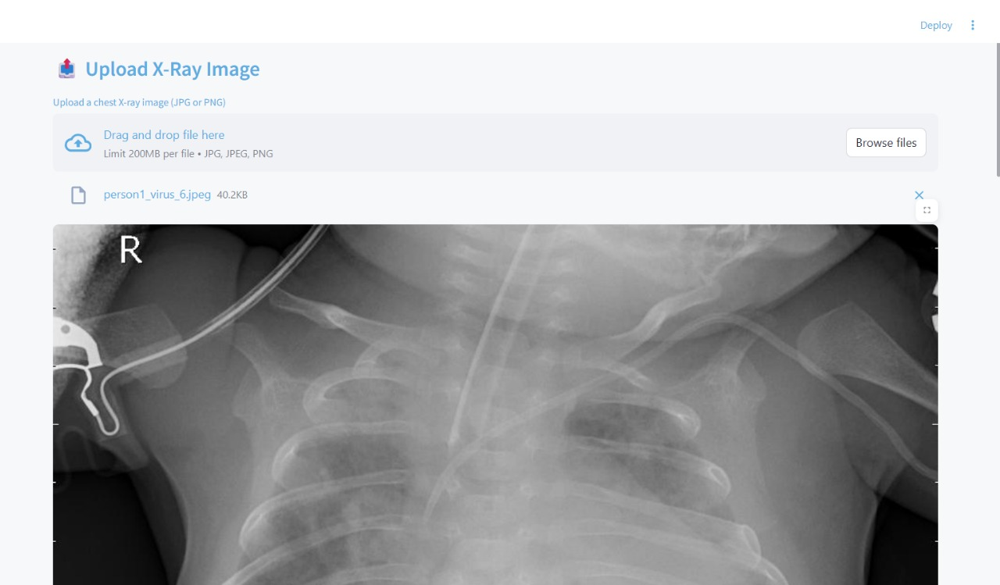
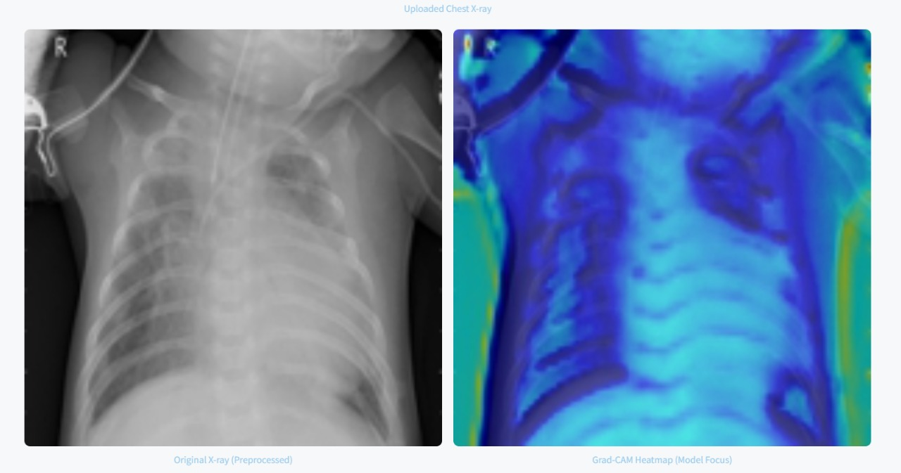
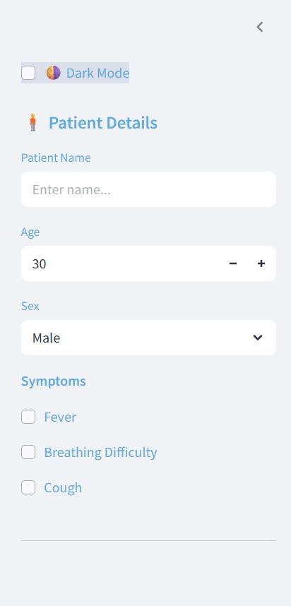
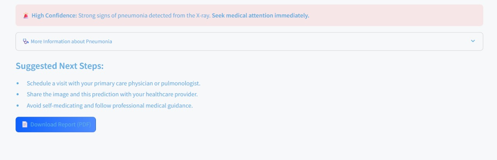
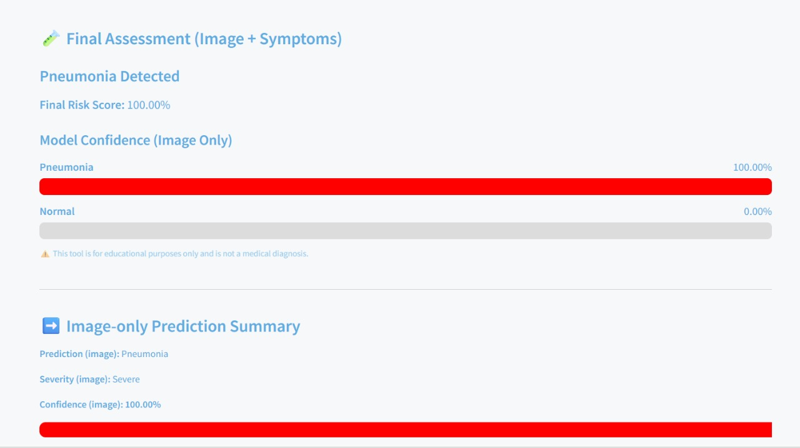
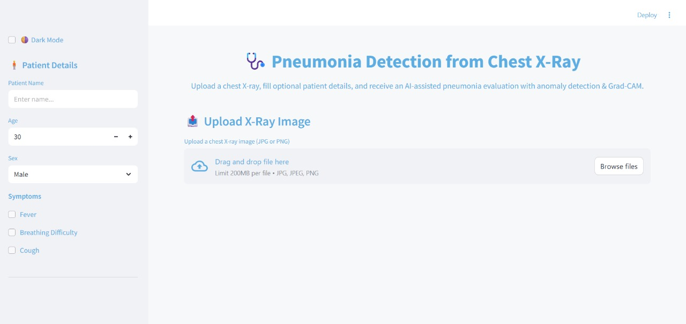
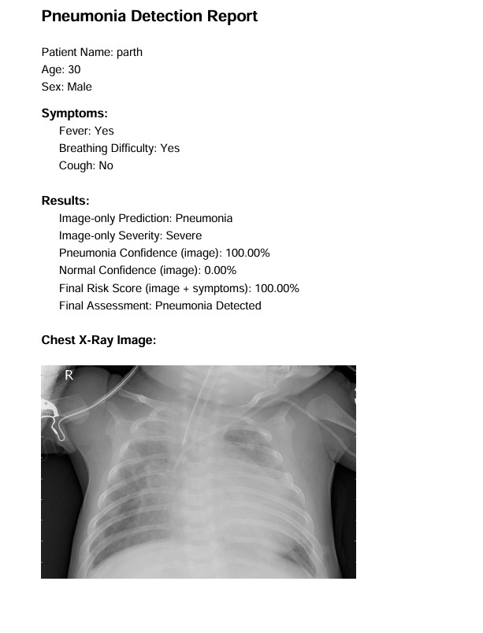

# Pneumonia Detection from Chest X-ray Images

Deep Learning | TensorFlow | CNN | Streamlit | Medical Image Classification
# Overview of the Project

This project presents a deep learning–based system for detecting pneumonia from chest X-ray images using a Convolutional Neural Network (CNN). A Streamlit web application allows users to upload X-ray images and receive predictions with confidence scores through an intuitive interface. The system is intended as an educational and decision-support tool rather than a replacement for professional medical diagnosis

# Problem Statement

Detecting pneumonia early from chest X-rays requires specialized radiological expertise, and misinterpretation can lead to:

Delayed treatment

Misdiagnosis in early stages

Increased burden on healthcare workers

There is a need for an automated tool that can help with initial screening, aiding medical professionals and improving diagnosis efficiency.
## Dataset

This project uses the **Chest X-Ray Images (Pneumonia)** dataset available on Kaggle.

https://www.kaggle.com/datasets/paultimothymooney/chest-xray-pneumonia

The dataset contains chest X-ray images classified into:

- Normal
- Pneumonia
# Approach and Solution

The solution is implemented using a Convolutional Neural Network (CNN) trained on a standard pneumonia dataset.
The pipeline includes:

🔹 1. Image Input:-

Users upload a chest X-ray through the Streamlit UI.

🔹 2. Preprocessing

Conversion to grayscale

Resizing to 150×150

Normalizing pixel values

🔹 3. Model Prediction

The trained CNN outputs a probability between 0 and 1, which is mapped to:

Normal

Pneumonia

🔹 4. Result Interface

The app displays:

Class prediction

Confidence percentage

A colored confidence bar

Medical guidance based on severity

🔹 5. Additional Validation (Optional Improvement)

A preprocessing rule filters out non–X-ray images by checking if the uploaded image appears grayscale.

## Tech Stack

### Languages
- Python

### Deep Learning
- TensorFlow
- Keras

### Libraries
- NumPy
- Pillow
- OpenCV
- Matplotlib

### Web Framework
- Streamlit

### Development
- Jupyter Notebook

#  Screenshots of the Product

## Screenshots

## Results

The CNN successfully classifies chest X-ray images into:

- Normal
- Pneumonia

The application displays:

- Prediction label
- Confidence score
- Medical guidance
# Additional Explanation
🔹 Handling Non-X-ray Images

A simple grayscale-detection function ensures that the system rejects photos that are not chest X-rays (e.g., dog photos, colorful images).

🔹 Model Limitations

The model may misclassify borderline cases.

It only supports binary classification (Normal vs Pneumonia).

For clinical use, the system should be validated with hospital-quality datasets.

🔹 Future Improvements

Add a “Not an X-ray” classifier using a 3-class model.

Improve UI with cropped/zoomed views.

Add Grad-CAM heatmaps to show why the model predicted Pneumonia.

Deploy on cloud platforms for public accessibility.

